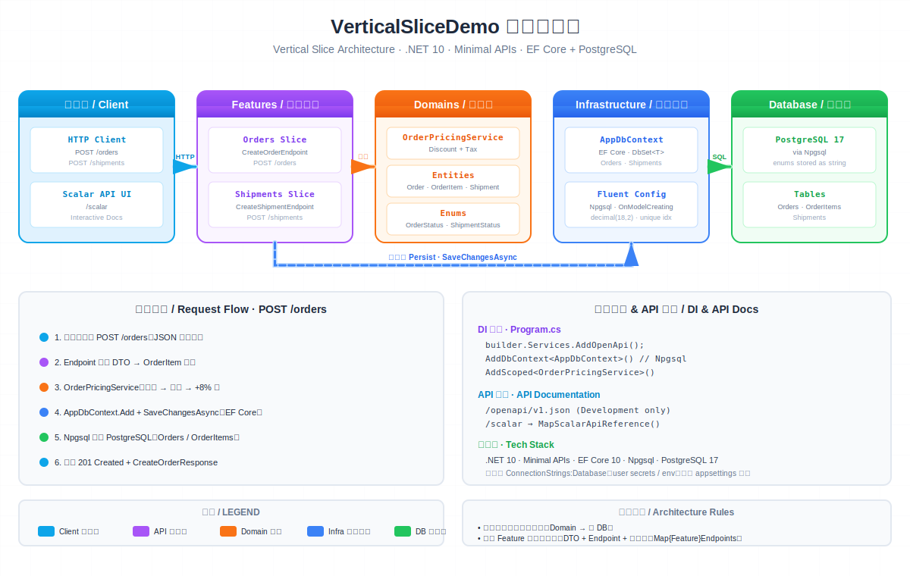

# VerticalSliceDemo

> A **.NET 10** ASP.NET Core Web API demonstrating **Vertical Slice Architecture** with Minimal APIs, EF Core (PostgreSQL via Npgsql), and OpenAPI/Scalar documentation.
> 基于 **.NET 10** 的 ASP.NET Core Web API 示例，演示**垂直切片架构（Vertical Slice Architecture）**。



> 📺 Open [`VerticalSliceDemo-architecture.svg`](VerticalSliceDemo-architecture.svg) directly in a browser to see the **animated** flow lines. (GitHub renders SVGs as static images.)

---

## ✨ Features / 特性

- **Vertical Slice Architecture** — each business capability is a self-contained slice.
- **Minimal APIs** — endpoint-per-file convention, no shared controller layer.
- **EF Core + PostgreSQL** via Npgsql, with fluent model configuration.
- **OpenAPI + Scalar** API reference UI (Development only).
- **Integration tests** with xUnit + Testcontainers (a real Postgres container per run).
- **Architecture tests** with NetArchTest — enforces slice & layer independence.

## 🧱 Architecture / 架构

The codebase is organized into **vertical slices**: each feature owns its own folder under `Features/` with all request/response DTOs and endpoint wiring colocated. There is no shared controller layer — the legacy `WeatherForecastController` is scaffold cruft.

**Endpoint registration flow (Minimal APIs):**

1. `Features/{Feature}/{Feature}Endpoints.cs` — a static aggregator exposing `Map{Feature}Endpoints(this WebApplication app)` that calls each endpoint's individual mapper.
2. `Features/{Feature}/{Verb}{Feature}Endpoint.cs` — a static class with `Map{Verb}{Feature}(this WebApplication app)` containing one `app.Map{Verb}(...)` call, plus the `record` DTOs for that endpoint.

Only the aggregators are wired into `Program.cs`. To add a new endpoint, add its mapper file and call it from the feature's aggregator — `Program.cs` stays untouched.

**Layers:**

| Layer | Responsibility |
|-------|----------------|
| `Features/` | HTTP endpoints (Minimal APIs) + per-endpoint DTOs |
| `Domains/` | Entities, enums, and **domain services** where business logic lives (`OrderPricingService`) |
| `Infrastructure/` | `AppDbContext` and EF Core fluent configuration |

> The domain layer has **no dependency on data access** — endpoints orchestrate domain services *and* persistence.

## 📁 Project Structure / 项目结构

```
VerticalSliceTestDemo.slnx
├─ VerticalSliceDemo/                 # Web API project
│  ├─ Program.cs                      # DI + pipeline + endpoint aggregators
│  ├─ Features/
│  │  ├─ Orders/                      # CreateOrderEndpoint, OrderEndpoints
│  │  └─ Shipmemts/                   # CreateShipmentEndpoint, ShipmentEndpoints
│  ├─ Domains/                        # Order, OrderItem, Shipment, OrderPricingService
│  └─ Infrastructure/                 # AppDbContext (EF Core)
└─ VerticalSliceDemo.Tests/           # xUnit + Testcontainers + NetArchTest
```

## 🚀 Getting Started / 快速开始

### Prerequisites

- [.NET 10 SDK](https://dotnet.microsoft.com/download)
- PostgreSQL 17 (for running the app; the test suite spins up its own container via Docker)

### Database connection

`Program.cs` resolves `ConnectionStrings:Database`, which is **not** defined in `appsettings*.json`. Provide it via **user secrets** (recommended) or an environment variable:

```bash
# User secrets
cd VerticalSliceDemo
dotnet user-secrets init
dotnet user-secrets set "ConnectionStrings:Database" "Host=localhost;Port=5432;Database=verticalslice;Username=postgres;Password=postgres"

# …or environment variable
export ConnectionStrings__Database="Host=localhost;Port=5432;Database=verticalslice;Username=postgres;Password=postgres"
```

> Provider is Npgsql — the connection string must target PostgreSQL.

### Run

```bash
dotnet build
dotnet run --project VerticalSliceDemo        # http://localhost:5127
```

In Development:
- OpenAPI spec: `http://localhost:5127/openapi/v1.json`
- Scalar UI: `http://localhost:5127/scalar`

### EF Core migrations

```bash
dotnet ef migrations add InitialCreate --project VerticalSliceDemo --output-dir Infrastructure/Migrations
dotnet ef database update --project VerticalSliceDemo
```

## 🔌 API Endpoints / 接口

| Method | Route | Description |
|--------|-------|-------------|
| `POST` | `/orders` | Create an order (computes discounts + tax via `OrderPricingService`) |
| `POST` | `/shipments` | Create a shipment for an existing order (one shipment per order) |

**Example — create an order:**

```http
POST /orders
Content-Type: application/json

{
  "customerName": "John Doe",
  "isPremiumCustomer": false,
  "items": [
    { "productName": "Laptop", "quantity": 1, "unitPrice": 999.99 },
    { "productName": "Mouse",  "quantity": 2, "unitPrice": 29.99 }
  ]
}
```

Pricing logic (`OrderPricingService`): `subtotal → discount (5%, or 10% for premium orders > 1000) → +8% tax`.

## 🧪 Testing / 测试

```bash
dotnet test                     # run all tests (requires Docker for integration tests)
dotnet test --filter "Category=Unit"   # architecture + pricing tests only
```

The test project (`VerticalSliceDemo.Tests`) includes:

- **Integration tests** (`CreateOrderTests`, `CreateShipmentTests`) — exercise the real HTTP pipeline against a Postgres container via Testcontainers.
- **Architecture tests** (`SliceIndependenceTests`) — NetArchTest rules ensuring slices don't cross-reference and that `Domain`/`Infrastructure` don't depend on `Features`.
- **Unit tests** (`OrderPricingServiceTests`) — verify the discount/tax math.

## 🛠️ Tech Stack / 技术栈

| Area | Technology |
|------|-----------|
| Runtime | .NET 10 |
| Web framework | ASP.NET Core Minimal APIs |
| ORM | Entity Framework Core 10 |
| Database | PostgreSQL 17 (Npgsql provider) |
| API docs | OpenAPI + Scalar.AspNetCore |
| Testing | xUnit, FluentAssertions, Testcontainers, NetArchTest |

## 📄 License

Provided as-is for demonstration purposes.
